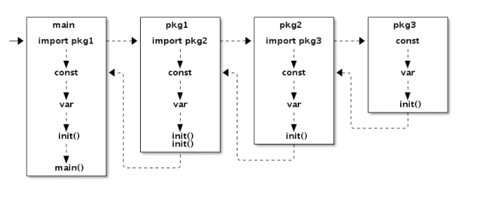

#### Golang 程序初始化顺序

在一个`Go`程序的初始化过程中一般会涉及到如下的一些元素：包，常量，变量，init()，main() 等；程序的初始化一般是从`main`包开始的；

如果`main`中`import`了其他的包，那么就会按照`import`的顺寻优先初始化这些引入的包；

在同一个包下面的`.go`文件会按照文件名的顺序初始化；在一个`.go`文件中，初始化的顺序是：常量，变量，init() 函数；如果在这个`.go`文件下面有多个`init()`函数，那么就会按照出现的顺序执行

等到引入的包初始化完成之后，就会继续初始化`main`包了，`main`包总是最后一个被初始化的；同一个包不管被引入几次，都只会被初始化一次

因为`Go`不允许循环依赖，所以不会出现`A->B->C->A`的情况；`Go`的初始化过程如下图所示：

