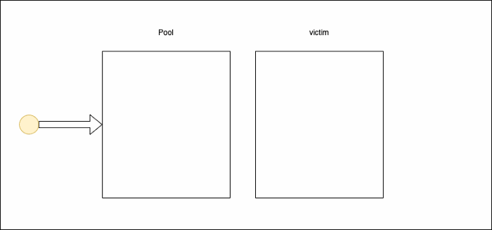

#### Translate sync.Pool

最近碰到了在`Go`项目中垃圾回收的问题，很多对象大量的重复创建导致`GC`的压力很大，而使用`sync.pool`能减少重复的对象创建，降低`GC`的压力

#### `sync.pool`是什么呢

`sync.pool`是`Go1.3`发布的一个特性，它是一个临时对象存储池

##### 为什么需要`sync.pool`呢

因为项目中频繁的创建对象和回收内存，造成了`GC`的压力；而`sync.pool`可以缓存对象暂时不用但是之后会用到的对象，并且不需要重新分配内存；这在很大程度上降低了`GC`的压力，并且提高了程序的性能

##### 如何使用`sync.Pool`呢

首先，你需要为`sync.Pool`设置一个`New`函数，这个函数就是当你获取不到对象时，返回的默认值。接下来，你就可以通过`Get`和`Put`方法检索对象和临时存储对象了

注：你创建的这个`pool`在第一次使用过后就不能再被赋值了；还有就是`Pool`中的对象随时都会被移除，并且不会有通知机制。而如果你存储的是一个对象的引用，那么这个对象也会被回收

```go
package main

import "sync"

type Person struct {
	Name string
}

//Initialing pool
var personalPool = sync.Pool{
	// New optionally specifies a function to generate
	// a value when Get would otherwise return nil.
	New: func() interface{} {
		return &Person{}
	},
}

func main() {
	// Get hold of an instance
	newPerson := personalPool.Get().(*Person)
	// Defer release function
	// After that the same instance is
	// reusable by another routine
	defer personalPool.Put(newPerson)

	// using instance
	newPerson.Name = "Jack"
}

```

### Benchmark

```go
package main

import (
	"sync"
	"testing"
)

type Person struct {
	Age int
} 

var (
	personPool = sync.Pool{
		New: func() interface{} {
			return &Person{}
		},
	}
)

func BenchmarkWithoutPool(b *testing.B)  {
	var p *Person
	b.ReportAllocs()
	b.ResetTimer()

	for i := 0; i < b.N; i++ {
		for j := 0; j < 10000; j++ {
			p = new(Person)
			p.Age = 23
		}
	}
}

func BenchmarkWithPool(b *testing.B) {
	var p *Person
	b.ReportAllocs()
	b.ResetTimer()
	for i := 0; i < b.N; i++ {
		for j := 0; j < 10000; j++ {
			p = personPool.Get().(*Person)
			p.Age = 23
			personPool.Put(p)
		}
	}
}
```

测试结果

```
cpu: Intel(R) Core(TM) i7-10700 CPU @ 2.90GHz
BenchmarkWithoutPool
BenchmarkWithoutPool 	    7933	    146347 ns/op	   80000 B/op	   10000 allocs/op

cpu: Intel(R) Core(TM) i7-10700 CPU @ 2.90GHz
BenchmarkWithPool
BenchmarkWithPool 	    1864	    595181 ns/op	       0 B/op	       0 allocs/op
```

Benchmark 参数说明

| 结果项               | 含义                                      |
| -------------------- | ----------------------------------------- |
| BenchmarkWithoutPool | **BenchmarkWithoutPool** 是测试的函数名   |
| 7933                 | 表示一共执行了**7933**次，即**b.N**的值   |
| 146347 ns/op         | 表示平均每次操作花费了**146347纳秒**      |
| 80000B/op            | 表示每次操作申请了**80000Byte**的内存申请 |
| 10000 allocs/op      | 表示每次操作申请了**10000**次内存         |

当然，这种重复的对象创建是比较合适使用`sync.Pool`对象的，但是对于一些简单的初始化动作，就不适合使用`sync.Pool`了，因为这也有一定的性能影响，所以需要选择合适的场景使用

#### `sync.Pool`的工作原理

`sync.Pool`有两个`containers`来存储对象，分别是：`local pool`和`victim cache`

根据`sync.pool.go`的源码中可以看出，这个`package`的`init`函数会注册一个`PoolCleanUp`函数，而这个函数就是通过`GC`触发的

```go
func init() {
   runtime_registerPoolCleanup(poolCleanup)
}
```

当`GC`的触发的时候，在`victim`中的对象就会被收集回收，而在`local pool`中的对象会被移动`victim cache`当中；下面是`poolCleanUp`的代码：

```go
func poolCleanup() {
   // Drop victim caches from all pools.
   for _, p := range oldPools {
      p.victim = nil
      p.victimSize = 0
   }

   // Move primary cache to victim cache.
   for _, p := range allPools {
      p.victim = p.local
      p.victimSize = p.localSize
      p.local = nil
      p.localSize = 0
   }

   oldPools, allPools = allPools, nil
}
```

新对象是放在`local pool`当中的，调用`pool.Put`也是将对象放在`local pool`当中的。

调用`pool.Get`时，会先从`victim cache `中获取，如果没有找到，则就会从`local pool`中获取，如果`local pool`中也没有，就会执行初始化时的`New Function`le，否则就返回`nil`了



从`Go1.12`之后添加了`mutex`来保证线程安全；从`Go1.13`在`sync.pool`中引入了双向链表，移除了`mutex`，改善了共享操作

#### 结论

总之，如果有一个对象需要频繁的创建，并且有很大的开销，那么你就可以使用`sync.pool`

参考：https://medium.com/swlh/go-the-idea-behind-sync-pool-32da5089df72