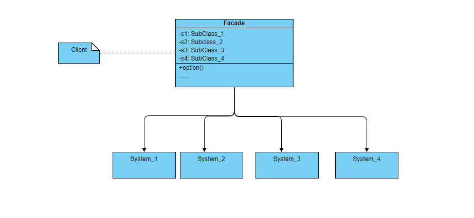

#### 外观模式

外观模式是一种结构型设计模式，就是为程序、框架和复杂的类提供简单的接口，方便客户端的使用

##### 解决的问题

记得小的时候看的都是那种黑白电视，如果需要更换频道，就要去找到频道模块，然后更换；如果要调整声音大小，那还得跑到电视机前面，找到声音模块调节声音；如果你又觉得电视太暗，你还得跑到电视机跟前，找到明亮度按钮来调整；也就是说，对电视的每个操作都得到电视机上找到对应的模块进行操作，这着实麻烦

后面厂家通过红外技术将电视上这些相关的功能全部封装到了遥控器当中，这样只需要操作遥控器就好了，就不再需要每次都跑到电视机前操作了了

这种应用就是今天要介绍的外观模式，封装多个子系统，只为客户端提供统一的接口，客户端只需要跟这个封装后的对象交互就可以了，不需要关注每个子系统具体的实现细节了

##### 应用

外观模式简化了客户端和复杂框架之间的交互，封装了客户端所需的功能，隐藏了实现细节，简化了客户端的使用



##### 代码示例

```go
package main

import "fmt"

func main() {
	r := NewRemoter()
	r.ChangeChannerl()
	r.AddLight(3)
	r.ReduceLight(2)
	r.AddAudio(2)
	r.RecudeAudio(20)
}

type Remoter struct {
	c *VideoChannel
	a *VideoAudio
	l *VideoLight
}

func NewRemoter() *Remoter {
	return &Remoter{
		c: &VideoChannel{},
		a: &VideoAudio{},
		l: &VideoLight{},
	}
}

func (r *Remoter) ChangeChannerl() {
	r.c.changeChannel()
}

func (r *Remoter) AddAudio(n int) {
	r.a.AddAudio(n)
}

func (r *Remoter) RecudeAudio(n int) {
	r.a.ReduceAudio(n)
}

func (r *Remoter) AddLight(n int) {
	r.l.AddLight(n)
}

func (r *Remoter) ReduceLight(n int) {
	r.l.Reduce(n)
}

type VideoChannel struct{}

func (v *VideoChannel) changeChannel() {
	fmt.Println("change channel")
}

type VideoAudio struct{}

func (v *VideoAudio) AddAudio(n int) {
	fmt.Printf("add %d audio\n", n)
}

func (v *VideoAudio) ReduceAudio(n int) {
	fmt.Printf("reduce audio %d\n", n)
}

type VideoLight struct{}

func (v *VideoLight) AddLight(n int) {
	fmt.Printf("add light %d\n", n)
}

func (v *VideoLight) Reduce(n int) {
	fmt.Printf("reduce light %d\n", n)
}
```

##### 优点

避免了客户端和子系统之间的紧耦合，增加了代码的灵活性

客户端不需要了解每个子系统的所有功能，只需要调用自己的需要的功能就好了

