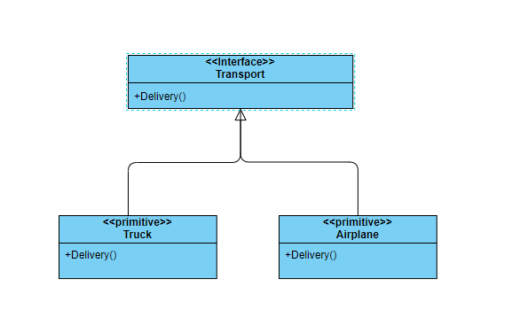
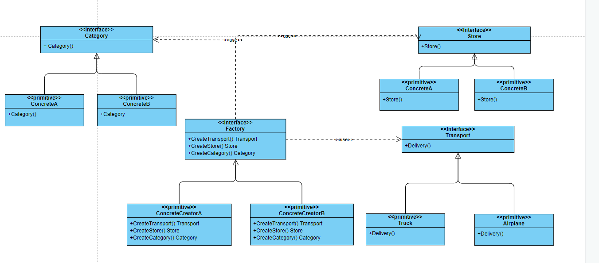

## 工厂模式

工厂模式是一种创建型模式，其在父类提供了一个创建对象的方法，允许子类来决定实例化对象的类型；下面通过一个具体的问题进行说明

### 问题

在本地有一个快递公司，使用卡车进行货物的运输; 运输的方式就是实例化`Truck`类，然后调用 `Truck`类的`Delivery`方法就可以完成运输了；

现在公司要扩张业务，需要支持航空运输和轮船运输，那如何能够优雅的应对公司业务的不断的扩张呢？

要是按照之前的方式，直接添加`Ship`和`Air`类的话，就需要更改客户端代码；这样一来，客户端的代码不但变的越来越复杂，并且紧紧的与具体对象的类型耦合在了一起；

如果之后业务不断的增加，会使得客户端代码越来越复杂，而且某一个类的任何一点变化，都需要更改客户端的代码，慢慢的客户端代码就会变的越来越难以维护，就会严重的影响公司的业务的扩张

下面提供了两种方案，来应对快递公司的这种不断变化的业务模型。

### 简单方案

首先需要解决的就是客户端代码和对象的类型耦合的问题；我们定义一个`Transport`接口，在接口类型中声明一个`Delivery`方法; 

然后让不同的运输类实现这个接口，这样对于客户端而言只需要传入具体的运输方式，就可以创建指定的运输对象了，这样客户端代码就不会和对象的具体类型耦合在一起了



代码示例：
```
import "fmt"

type TransportSimple interface {
	Delivery() string
}

func CreateTransport(typ string) TransportSimple {
	switch typ {
	case "truck":
		return &Truck{}
	case "airPlane":
		return &AirPlane{}
	default:
		return nil
	}
}

type Truck struct{}

func (t *Truck) Delivery() string {
	return fmt.Sprintf("use truck delivery...")
}

type AirPlane struct{}

func (a *AirPlane) Delivery() string {
	return fmt.Sprintf("use airplane delivery...")
}

//客户端代码
func main() {
	t := CreateTransport("truck")
	t.Delivery()
}

```
随着公司运输方式的增加，公司运输的货物也越来越多，但是也收到了不少的差评；因为很多生鲜类的货物，到了用户手里都变质了；还有货物到了快递公司也是随便的堆放；

公司为了解决这些问题，又增加了分类`Category`和存储`Store`功能，分类就是在货物到公司后，对货物进行分类；存储的话就是根据分类的结果，对货物分别存储，等到有合适的路线再取出来运输

但是之前的方案好像不能够很好的解决这两种功能的加入，所以公司想有没有一个更加合适的方案，既能应对运输线路的增加，又能解决业务扩张带来的这些问题呢？

### 复杂方案

现在需要一个工厂接口，在这个接口中定义创建不同对象的方法，每个对象对应一种功能；然后由具体的类型去实现这个接口

这就相当于一条生成线了，客户端只需要创建一个`Factory`的实例就可以对货物进行分类，存储，运输等功能了；并且如果之后有其他的功能的话，只需要添加到这个工厂类中就可以了；下面是类图示例：



代码示例如下：
```
package main

type Factory interface {
	CreateTransport() TransportSimple
	CreateStore() Store
}

type CreatorA struct{}

func (c *CreatorA) CreateTransport() TransportSimple {
	return &Truck{}
}

func (c *CreatorA) CreateStore() Store {
	return &ColdStore{}
}

type CreatorB struct{}

func (c *CreatorB) CreateTransport() TransportSimple {
	return &AirPlane{}
}

func (c *CreatorB) CreateStore() Store {
	return &HotStore{}
}

func CreateFactory(typ string) Factory {
	switch typ {
	case "coldWithTruck":
		return &CreatorA{}
	case "hotWithAirPlane":
		return &CreatorB{}
	}
	return nil
}

```

### 优缺点

#### 优点

-  你可以避免创建者和具体产品之间的紧密耦合。
-  单一职责原则。 你可以将产品创建代码放在程序的单一位置， 从而使得代码更容易维护。
-  开闭原则。 无需更改现有客户端代码， 你就可以在程序中引入新的产品类型。

#### 缺点

- 应用工厂方法模式需要引入许多新的子类， 代码可能会因此变得更复杂。 最好的情况是将该模式引入创建者类的现有层次结构中。