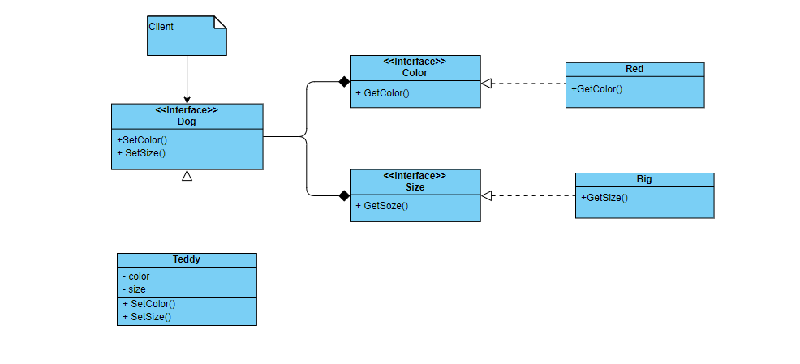

### 桥接模式

桥接模式是一种结构型设计模式，可以将一个大类或者一系列紧密相关的类拆分为抽象和实现两个独立的层次结构，从而能在开发时分别使用

#### 问题模型

假如现在有一个 `Dog`类，而你在这个类的基础上扩展出了`Poodle Dog`和`Teddy Dog`这两种类型的`Dog`，之后又希望在添加新的类`Size`来区分不同大小的 `Dog`，那么此时你就需要添加新的类`SmallPoodleDog,BigPoodleDog,SmallTeddyDog`和`BigTeddyDog`

当然，如果此时有需要一个`Color`类来区分`Dog`的颜色，那么这时候就要再进行扩展了，就会出现`RedSamllPoodleDog`这样的类；这时每增加一种维度的变化就需要增加很多的类，同样每增加一种品种的 `Dog`，也需要添加很多的类

但是，如果此时直接将这些`Small`类，`Red`类组合到`PoodleDog`中的话，又会增加代码的耦合性，每次`Red`类的变化都会引起`PoodleDog`的更改；

那如何才能解决这个问题呢？这就需要用到桥接模式

#### 解决方案

桥接模式就是明确识别系统中的独立变化的几个维度，拆分抽象和实现这两个独立的层次结构，降低程序中类的耦合度

也就是说，不能直接让`PooleDog`组合`Red`类，中间需要一个桥梁，而这个桥梁就是`Red,Blue`等同一维度的抽象表示，然后在这个`PooleDog`中组合这个抽象类，这样就将`PooleDog`和`Red`类分离开来了，`PooleDog`类的变化不会影响`Red`类，同样的`Red`的变化也不会影响`PooleDog`类

这就是设计模式中的依赖倒置原则：要针对接口进行编程，而不是针对实现进行编程；并且能够增加程序的扩展性，降低了程序之间的耦合性

#### UML类图



#### 示例代码

```go
package main

import "fmt"

func main() {
	b := &BlueColor{}
	m := &Medium{}

	c := &Dog{
		c: b,
		s: m,
	}
	c.WithMediumBlue()
}

type Dog struct {
	c color
	s Size
}

func (c *Dog) WithMediumBlue() {
	c.c.SetColor()
	c.s.SetSize()
}

type color interface {
	SetColor()
}

type BlueColor struct {}

func (b *BlueColor) SetColor() {
	fmt.Println("color blue")
}

type Size interface {
	SetSize()
}

type Medium struct {}

func (m *Medium) SetSize() {
	fmt.Println("medium size")
}
```

#### 使用场景

当一个类的内部有两种或者多种不同维度的变化时，使用桥接模式可以解耦这些变化的维度，减少程序的耦合性，使代码结构更加的稳定

#### 优点

1. 降低代码的耦合性
2. 减少了不同维度造成的类的数量的增加
3. 可以很好的对程序进行扩展

#### 缺点

1. 增加了代码的复杂度

