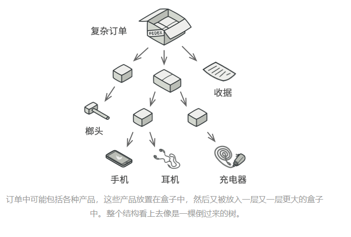
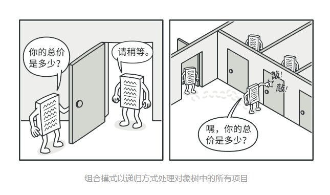
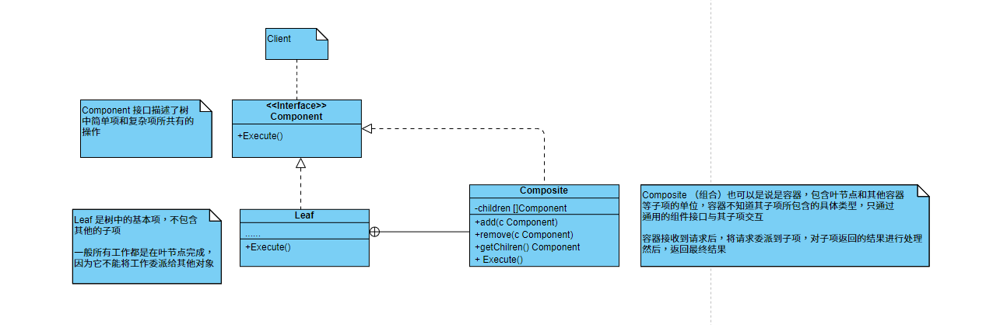

### 组合模式

组合模式，又称为部分-整体模式，是一种结构型设计模式，可以使用它将相似对象组合成树状结构，并且能像使用独立对象一样使用它们

#### 问题模型

有两类对象：盒子和商品；一个盒子中有多个商品和更小的盒子，而在这些小的盒子中又有其他的商品和一些更小的盒子，而这些更小的盒子中也有商品和其他更小的盒子，依次类推

现在需要在这些类的基础上开发一个订单系统，在订单中可以包含无包装的商品，也可以包含包装其他商品的盒子，以及其他的盒子；那此时如何计算每张订单的总价呢？



当然，在现实的生活中，可以一个个的打开所有的盒子，然后将所有盒子中的商品价格加起来就好了

但是，在程序中不能简单的使用循环来完成这种工作；因为，首先你必须知道所有的盒子和商品的类别；其次，你要知道所有的嵌套层数，以及每个盒子的包装细节；这对于程序来说一层层的拆分会变得的非常的复杂，甚至基本不可以

那现在如何才能通过程序解决这个问题呢？答案就是使用组合模式

#### 解决方案

组合模式建议通过一个通用的接口与商品和盒子进行交互，并且在这个接口中声明一个计算总价的方法；现在的重点就是放到了如何实现这个计算总价的方法了

对于一个盒子，该方法遍历这个盒子中所有的对象，询问每个对象的价格，然后返回这个盒子的总价；对于一个商品，则直接返回这个商品的价格

如果在这个盒子中还存在其他更小的盒子，遍历这个盒子的所有对象的价格，依次类推，直到计算出所有内部组成部分的价格为止；当然，你也可以在计算每个盒子的价格的时候附加上这个盒子的包装价格作为和盒子的费用



组合模式的最大的优点就是无需了解这个树状结构中对象的具体类型；你也不需要知道对象是商品还是盒子；只需要调用通用的接口中的方法，以相同的方式对其进行处理即可；当你调用该方法后，对象就会沿着这个树结构传递下去

##### UML类图



##### 代码示例

```go
package main

import "fmt"

func main() {
	smallBox := NewGoodsBox()
	pen := NewPen(10)
	book := NewBook(12)
	smallBox.Add(pen)
	smallBox.Add(book)

	bigBox := NewGoodsBox()
	p1 := NewPen(20)
	p2 := NewPen(10)
	b1 := NewBook(1)
	bigBox.Add(p1)
	bigBox.Add(p2)
	bigBox.Add(b1)
	bigBox.Add(smallBox)

	total := bigBox.Compute()
	fmt.Println(total)
}

type Component interface {
	Compute() int64
}

type GoodsBox struct {
	c []Component
}

func NewGoodsBox() *GoodsBox {
	return &GoodsBox{}
}

func (g *GoodsBox) Add(c Component) {
	if g.c == nil {
		g.c = make([]Component, 0)
	}
	g.c = append(g.c, c)
}

func (g *GoodsBox) Compute() int64 {
	var total int64

	if g.c == nil {
		return 0
	}
	for _, c := range g.c {
		total = total + c.Compute()
	}
	return total
}

type Pen struct {
	price int64
}

func NewPen(price int64) *Pen {
	return &Pen{price: price}
}

func (p *Pen) Compute() int64 {
	return p.price
}

type Book struct {
	price int64
}

func NewBook(price int64) *Book {
	return &Book{price: price}
}

func (b *Book) Compute() int64 {
	return b.price
}
```

##### 应用场景

组合模式可适用于整体和部分可以统一处理的场景中；比如，学校要统计学生的男女比例，那首先就需要先拿到每个班级的男女生人数，接下来就是统计每个专业的男女人数，每个学院的男女人数，最后获取到整个学校的男女人数，这样就可以获取到整个学校的男女比例了

同样的，不同的对象之间是相互独立的，比如上面的场景中，每个班级也可以计算各个班级的男女比例，每个学院也可以计算各个学院的男女比例，相互之间不会有影响

##### 优点

不同类型的对象之间相互独立，一个节点类型的的变化不会影响其他的节点类型

程序的扩展性增强，新增新的节点类型，不会造成对原有结构造成影响

使得客户端对单个对象和组合对象的使用具有一致性