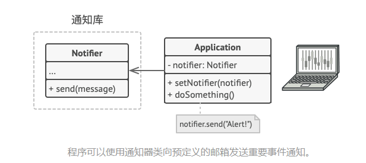
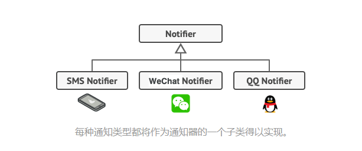
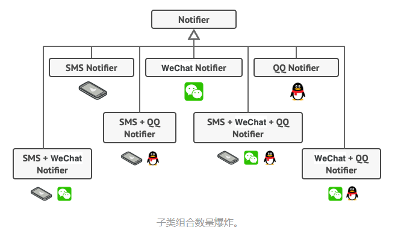
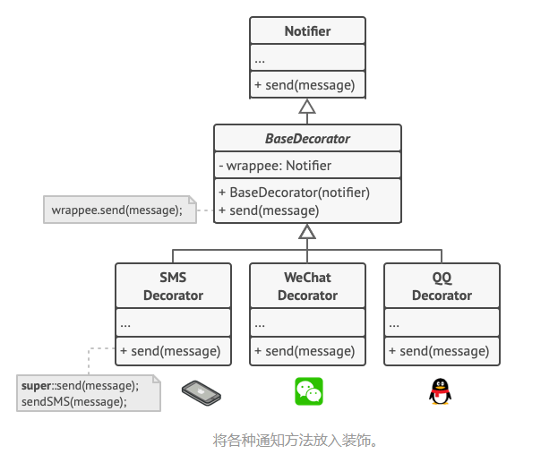
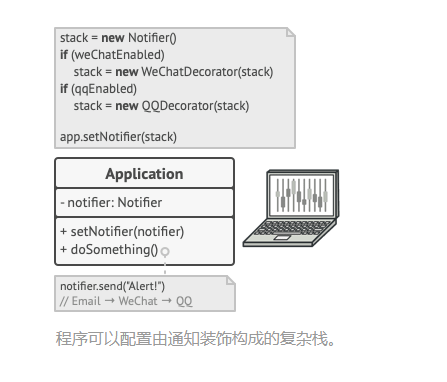
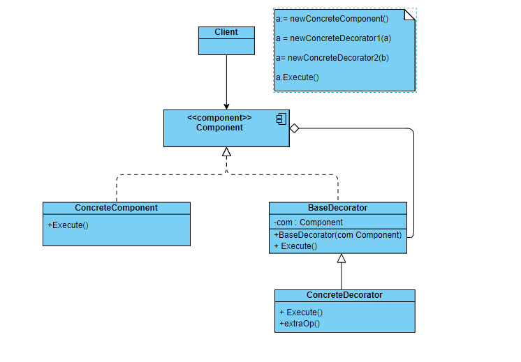

#### 装饰模式

装饰模式是一种结构型设计模式，是在运行时动态的给现有对象增加一些功能，但同时又不会改变原对象的代码结构

装饰器本质上就是创建一个装饰类，包装了原有类，并且保持装饰类和原有类有相同的方法签名，然后在原有类的方法上增加一些其他的功能

那装饰器主要是用来解决什么问题呢

##### 解决了什么问题

通常，当你想要扩展一个类的功能时，首先想到的方法就是使用继承，这样子类不但有了父类的功能，还能对其添加一些新的功能

但使用继承的问题就是，继承产生了一个新的静态类型，无法在运行时修改其行为，只能通过子类来代替父类；并且随着功能的不断增加，会出现各种各样不同的子类，不断增加的子类会导致程序变的越来越复杂

比如：公司有一个异常通知机制（Notifier），一开始的时候只会通过邮件（E-Mail）进行通知



但是，为了能使用户及时响应异常，又增加了短信（Text-Message）通知机制，微信（Wechat）等通知机制；所以，为了满足这种需求就让其他的通知类继承`Notifier`，然后各个子类再实现自己的通知机制就好了



后来发现，多种不同的通知机制能更加快速的通知到用户，所以现在要在出现异常时用多种通知机制通知用户，比如：同时支持短信和微信，或者同时支持邮件和短信等等

但如果还是使用继承的方式，子类的个数就完全不可控了；这不仅增加了通知代码库的复杂度，同时也会使得客户端代码变的异常的复杂



那现在如何解决这种子类不断膨胀的问题呢？答案就是使用装饰模式

##### 如何解决这个问题

封装器是装饰模式的别称，封装器就是在一个对象中封装另一个类的对象，并且与目标对象有相同的方法签名；当接收到客户端的请求的时候，封装器会委派目标对象完成指定的功能，然后再在该方法之前或者之后增加一些自己的代码逻辑，最终有可能改变运行结果

那什么时候封装器可以被称之为真正的装饰器呢？因为封装器与原对象实现了相同的接口，所以对于客户端而言，这些对象是完全一样的

封装器中引用的成员变量可以是遵循相同接口的任意对象，这使得你可以将一个对象放入多个封装器内，并且在该对象上添加这个封装器的组合功能，这就使得封装器变成了一个具有装饰功能的装饰器了

这感觉就像是流水线的工程一样，每到一个节点就会在原有的基础上增加一些新的功能，最终完成整个产品的装配

在消息通知中，我们可以将邮件通知放在基类的通知器当中，而将其他的通知方式放到装饰器当中，并且是他们都是实现相同的接口



在客户端代码中将基础的通知器放入一系列所需要的装饰器当中，形成一个栈结构



因为所有的装饰器都实现了相同的接口，所以客户端只需要和最后一个入栈的对象交互就可以了，并不需要关心是和纯粹的通知器对象交互还是和装饰器对象交互

我们可以使用相同方法来完成其他行为 （例如设置消息格式或者创建接收人列表）。 只要所有装饰都遵循相同的接口， 客户端就可以使用任意自定义的装饰来装饰对象

##### `UML` 类图



##### 代码示例

```go
package main

import "fmt"

func main() {
	e := &ExceptionNotifier{}
	s := NewWechatNotifer(e)
	s = NewTextMessageNotifier(s)

	s.Notify()
}

type ExceptionNotifier struct {}

func (e *ExceptionNotifier) Notify() {
	fmt.Println("exception notify")
}

type Notifier interface {
	Notify()
}

type WechatNotifier struct {
	notifier Notifier
}

func NewWechatNotifer(notifier Notifier) Notifier {
	return &WechatNotifier{notifier:notifier}
}

func (w *WechatNotifier) Notify() {
	w.notifier.Notify()
	fmt.Println("Notify with wechat")
}

type TextMessageNotifier struct {
	notifier Notifier
}

func NewTextMessageNotifier(notifier Notifier) Notifier {
	return &TextMessageNotifier{notifier:notifier}
}

func (t *TextMessageNotifier) Notify() {
	t.notifier.Notify()
	fmt.Println("Notify with textMsg")
}

```

##### 应用场景

如果不想更改现有的对象，并且希望在运行的时候为现有对象增加新的功能，就可以使用装饰器模式；它可以对原有的对象在运行时增加各种所需要的功能，并且不需要你更改原对象的代码结构

如果你发现使用继承的方式扩展对象的功能会使得代码变的的很复杂，那么就可以使用装饰器模式，通过组合的方式，使得代码更加的灵活

##### 优缺点

装饰模式的一些优点：

- 可以更加灵活的扩展原对象的功能
- 可以将大功能拆分成各种装饰器，增加代码的灵活性和复用性

装饰模式的一些缺点：

- 在封装器栈中删除特定的封装器比较困难
- 各层代码的初始化配置会比较的麻烦

参考链接：https://refactoringguru.cn/design-patterns/decorator