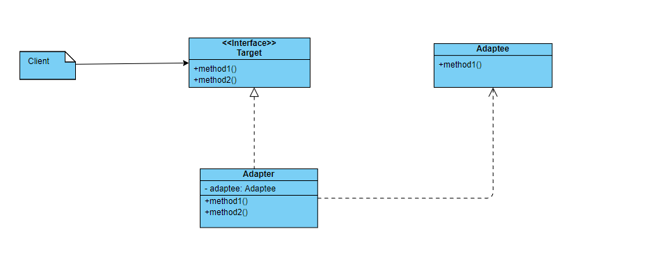

### 适配器设计模式

适配器模式是把一个类的接口变换为另一个类所期望的接口，使得原本因为接口不匹配而无法一起工作的类，变的可以正常调用

适配器别名有：Wrapper，Adapter，它是一种结构型设计模式，通过扩展原本不适配的类来满足特定的需求

#### 应用场景

在计算机当中，有网卡驱动和显卡驱动等等，那这些驱动有什么作用呢？

作用就是为了能够适配操作系统；计算机发展过程中出现了越来越多的硬件厂商，比如：intel，amd，三星，华为等等，不同的厂商意味着不同的实现细节；

为了能够统一这种不断变化的局面，操作系统为不同的硬件提供了统一了接口，这些接口就是适配器，比如：网卡有网卡适配器，显卡有显卡适配器，而操作系统只是这些适配器通信，而不会管每个硬件具体实现细节；

而响应的各个硬件厂商也只需要为其出厂的对应的硬件实现相应的适配器就好了，实现的这些适配器就是所谓的驱动；这样的话，同一个操作系统就可以对应不同厂商的硬件了，只要该厂商提供了对应的适配器即可

#### 类图和示例代码



示例代码：

```go
package main

import "fmt"

type Target interface {
	Print(s string)
}

type Adapter struct {
	at *adaptee
}

func (a *Adapter) Print(msg string) {
	a.at.PrintMsg(msg)
}

type adaptee struct {
}

func (a *adaptee) PrintMsg(msg string) {
	fmt.Println(msg)
}

func NewAdapter() *Adapter {
	return &Adapter{at:&adaptee{}}
}

func main() {
	a := NewAdapter()
	a.Print("this is adapter pattern")
}
```

#### 优点

- 扩展性

  在原来的系统中进行了扩展，让其可以适配新的系统，并且不更改原系统的代码

- 复用性

  两个系统接口不符合，但是功能相同，通过适配器只需要进行简单的变化就可以复用了，不需要再将已有的功能再实现一遍

#### 缺点

- 复杂度

  为了适配现有的接口，需要通过增加新的类型进行变换