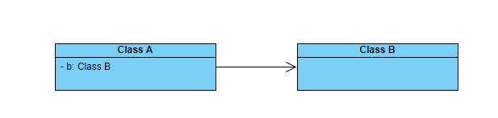
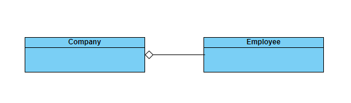
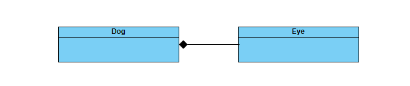

##### 依赖，关联，聚合和组合

这两天看一些东西的时候，发现其实我对类之间的这些关系还是比较模糊的，看着好像都一样，为什么有这么多的概念呢？

##### 依赖关系

两个类结构之间的依赖关系是临时的，非常弱的关系；假如，现在有两个类`A` 和`B`；现在`A`类对`B`类的依赖体现在如下的几个方面：

- `A`类的方法中存在局部变量指向`B`类
- `A`类中的形参为`B`类的类型
- `A`类中调用了`B`类的静态方法

在` UML `中依赖关系表现如下所示：

##### 关联关系

关联关系使一个类可以访问另一个类的方法和属性；关联关系是比依赖关系在两个类之间连接更强一点的关系，关联关系可以是双向的，也可以是单向的

一般关联关系在两个两类结构当中以如下的方式体现：

- `A`类的类属性中存在`B`类的类型
- `A`类中引用了类型`B`的一个全局变量

在`UML`中关联关系以如下的方式表示：

##### 聚合关系

两个类之间的聚合关系是类似于个体与整体的关系，它是一种特殊的关联关系；当然，关联关系和聚合关系在语法是很难区分，只能在语义上进行区分了

比如：一个轮胎和一辆车之间的关系；公司和员工之间的关系；也就是说，它们有各自独立的生命周期，当整体销毁时，个体有可能还会存在，并且个体的创建和整体的创建不需要同步进行，可以在整体之前，也可以在整体之后

在`UML`中聚合关系以如下的方式表示：

##### 组合关系

两个类之间的组合关系是部分和整体的关系，它也是一种特殊的关联关系，并且是比聚合关系更强的连接关系

组合关系中整体和部分的生命周期是一致的，也就是说整体的结束也就是意味着部分的结束；例如：狗和狗的耳朵，眼睛等就是整体和部分的关系

在`UML`中组合关系以如下的方式表示：

